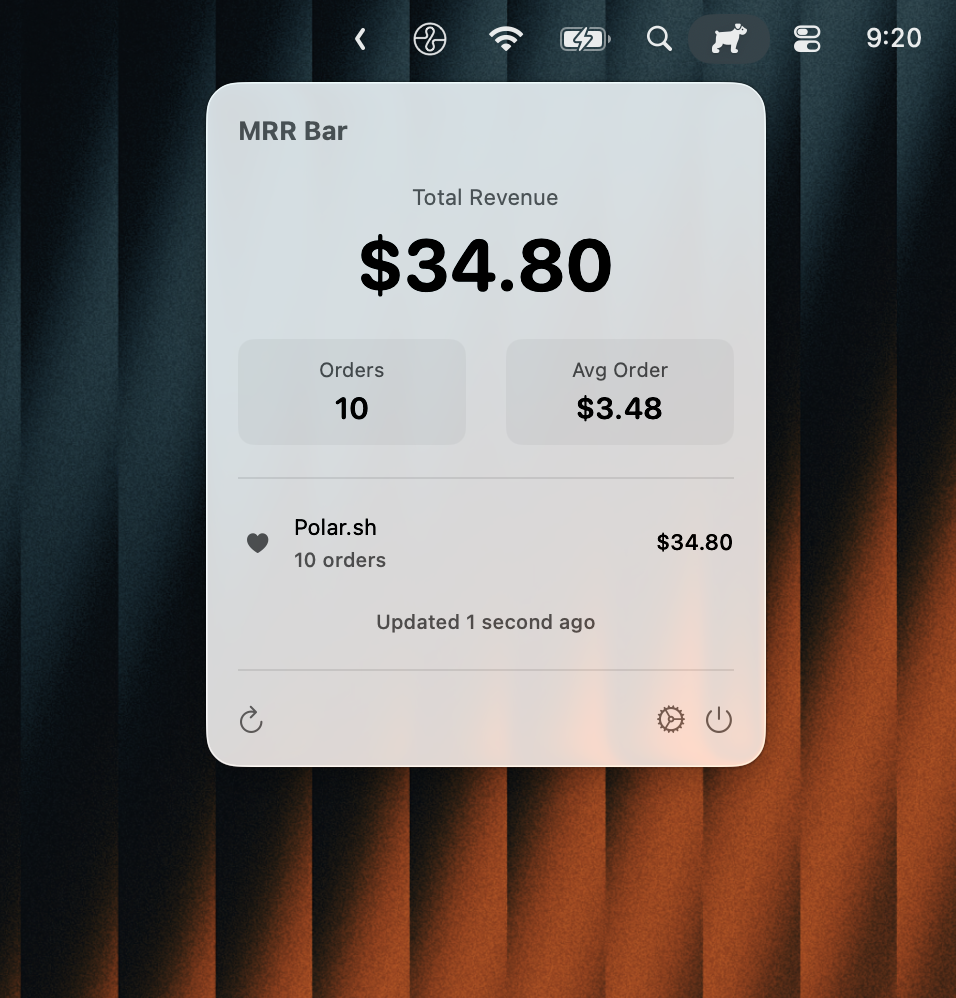

# MRR Bar

A minimal macOS menu bar app to track your SaaS revenue in real-time. Connect your Stripe and Polar.sh accounts to see your total revenue at a glance.


<p align="center">
  
</p>

## Features

- **Real-time Revenue Tracking** - See your total revenue from the menu bar
- **Multi-platform Support** - Connect Stripe and Polar.sh (more coming soon)
- **Secure Storage** - API keys stored in macOS Keychain
- **Detailed Stats** - View order counts, average order value, and per-platform breakdown
- **Auto-refresh** - Configurable refresh intervals (1 min to 1 hour)
- **Native macOS App** - Built with SwiftUI, lightweight and fast
- **Privacy First** - No data leaves your machine except API calls to your connected services

## Screenshots

<p align="center">
  
  
</p>

## Installation

### Download

Download the latest release from the [Releases](https://github.com/yourusername/mrr-bar/releases) page.

### Build from Source

**Requirements:**
- macOS 13.0+
- Xcode 15.0+

```bash
# Clone the repository
git clone https://github.com/yourusername/mrr-bar.git
cd mrr-bar

# Open in Xcode
open "MRR Bar.xcodeproj"

# Build and run (⌘R)
```

## Setup

### Stripe

1. Go to [Stripe Dashboard](https://dashboard.stripe.com/apikeys)
2. Navigate to **Developers → API keys**
3. Copy your **Secret key** (starts with `sk_live_` or `sk_test_`)
4. Paste in MRR Bar settings

### Polar.sh

1. Go to [Polar.sh](https://polar.sh)
2. Navigate to **Settings → Developers → Access Tokens**
3. Click **Create Token**
4. Select the `orders:read` scope
5. Copy the token (starts with `polar_oat_`)
6. Paste in MRR Bar settings
7. (Optional) Add your Organization ID for multi-org accounts

## Configuration

Access settings via the ⚙️ gear icon in the popover or `⌘,`

| Setting | Description |
|---------|-------------|
| Stripe Secret Key | Your Stripe API secret key |
| Polar Access Token | Your Polar.sh organization access token |
| Polar Organization ID | (Optional) Filter by specific organization |
| Refresh Interval | How often to fetch new data (1-60 min) |

## Privacy & Security

- **API keys are stored in macOS Keychain** - encrypted and secure
- **No analytics or tracking** - your data stays on your machine
- **No external servers** - direct API calls to Stripe/Polar only
- **Open source** - audit the code yourself

## Tech Stack

- **SwiftUI** - Modern declarative UI framework
- **Combine** - Reactive data handling
- **URLSession** - Native networking
- **Security.framework** - Keychain storage

## Project Structure

```
MRR Bar/
├── MRR_BarApp.swift      # App entry point & menu bar setup
├── MenuBarView.swift      # Main popover UI
├── SettingsView.swift     # Settings window
├── RevenueManager.swift   # Business logic & API calls
├── KeychainHelper.swift   # Secure storage utilities
└── Assets.xcassets/       # App icons and images
```

## Contributing

Contributions are welcome! Please read our [Contributing Guide](CONTRIBUTING.md) before submitting a PR.

### Adding a New Platform

1. Add API integration in `RevenueManager.swift`
2. Create a new `fetchXXXData()` method
3. Add corresponding `@Published` properties
4. Update `MenuBarView.swift` to display the new platform
5. Add settings fields in `SettingsView.swift`
6. Update `KeychainHelper` keys if needed

### Development Setup

1. Fork the repository
2. Create a feature branch (`git checkout -b feature/amazing-feature`)
3. Commit your changes (`git commit -m 'Add amazing feature'`)
4. Push to the branch (`git push origin feature/amazing-feature`)
5. Open a Pull Request

## Roadmap

- [ ] Lemon Squeezy integration
- [ ] Gumroad integration
- [ ] Revenue charts/graphs
- [ ] Multiple currency support
- [ ] Menu bar revenue display option
- [ ] Notifications for new sales
- [ ] Export data to CSV

## License

This project is licensed under the MIT License - see the [LICENSE](LICENSE) file for details.

## Acknowledgments

- Built with [SwiftUI](https://developer.apple.com/xcode/swiftui/)
- Icons from [SF Symbols](https://developer.apple.com/sf-symbols/)
- Inspired by the indie hacker community

## Support

- ⭐ Star this repo if you find it useful
- 🐛 [Report bugs](https://github.com/yourusername/mrr-bar/issues)
- 💡 [Request features](https://github.com/yourusername/mrr-bar/issues)
- 🐦 Follow [@yourusername](https://twitter.com/yourusername) for updates

---

<p align="center">
  Made with ❤️ for indie hackers
</p>
